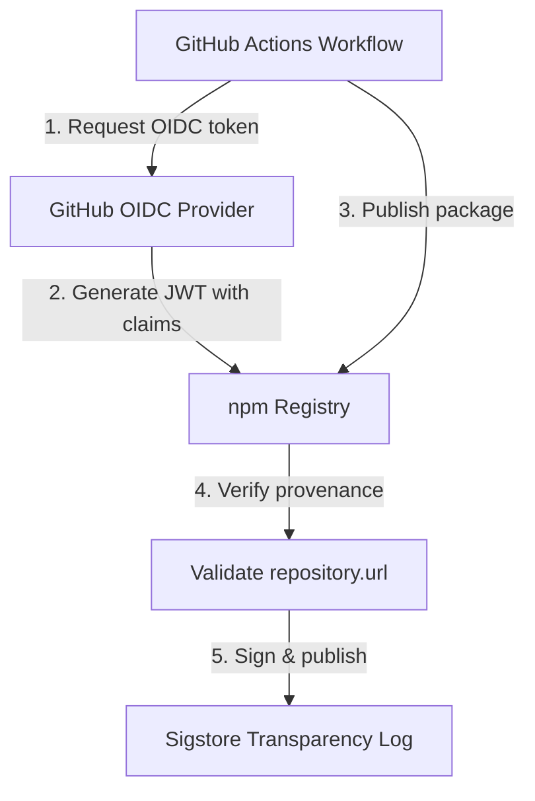

# Issue #10: Comprehensive Analysis - npm Trusted Publishing Failures

## Executive Summary

This document provides a comprehensive analysis of Issue #10: "Trusted publishing does not work in our CI/CD", covering multiple failure scenarios, their root causes, and evidence-based solutions drawn from CI logs, workflow comparison, and online research.

**Status**: ✅ **PARTIALLY RESOLVED**

- **Original E422 Error**: ✅ Fixed in PR #11
- **npm Package**: ✅ Successfully published version 0.2.5 with provenance
- **Automated CI/CD**: ✅ Working correctly on main branch
- **Manual Release**: ❌ Still failing with E404 authentication error

## Issue Timeline

| Date/Time (UTC)     | Event                                  | Status     | CI Run                                                                                     | Details                            |
| ------------------- | -------------------------------------- | ---------- | ------------------------------------------------------------------------------------------ | ---------------------------------- |
| 2025-12-09 06:27:13 | Automated release attempt v0.2.4       | ❌ Failed  | [#20054176340](https://github.com/link-foundation/lino-arguments/actions/runs/20054176340) | E422: Missing repository field     |
| 2025-12-09 06:57:00 | PR #11 merged (added repository field) | ✅ Success | [#20054779258](https://github.com/link-foundation/lino-arguments/actions/runs/20054779258) | Published v0.2.5 successfully      |
| 2025-12-09 07:03:31 | Manual instant release v0.2.6          | ❌ Failed  | [#20054899930](https://github.com/link-foundation/lino-arguments/actions/runs/20054899930) | E404: Access token expired/revoked |

## Part 1: The E422 Error - Missing Repository Field (RESOLVED ✅)

### Error Message

```
🦋  error an error occurred while publishing lino-arguments:
E422 422 Unprocessable Entity - PUT https://registry.npmjs.org/lino-arguments -
Error verifying sigstore provenance bundle: Failed to validate repository information:
package.json: "repository.url" is "", expected to match
"https://github.com/link-foundation/lino-arguments" from provenance

Provenance statement published to transparency log:
https://search.sigstore.dev/?logIndex=752580455
```

### Root Cause

npm's trusted publishing performs server-side validation to ensure `repository.url` in `package.json` matches the Source Repository URI in the OIDC-signed provenance certificate.

**The problem**: `package.json` was completely missing the `repository` field.

### How npm Trusted Publishing with OIDC Works



**OIDC JWT Claims Include:**

- `repository`: `link-foundation/lino-arguments`
- `workflow`: `.github/workflows/main.yml`
- `ref`: `refs/heads/main`
- `repository_owner`: `link-foundation`

### Validation Requirements Checklist

For npm provenance with OIDC trusted publishing:

| Requirement                               | Status | Notes                                    |
| ----------------------------------------- | ------ | ---------------------------------------- |
| `id-token: write` permission              | ✅     | Line 149 in main.yml                     |
| npm CLI version ≥ 11.5.1                  | ✅     | Upgraded via `npm install -g npm@latest` |
| `repository` field in package.json        | ❌→✅  | **Missing** → Added in PR #11            |
| Trusted publisher configured on npmjs.com | ✅     | Confirmed in screenshot                  |
| Publishing from public repository         | ✅     | link-foundation/lino-arguments is public |

### The Fix (PR #11)

Added required `repository` field to `package.json`:

```json
{
  "repository": {
    "type": "git",
    "url": "https://github.com/link-foundation/lino-arguments.git"
  }
}
```

### Verification of Fix

After PR #11 merge:

- ✅ CI Run #20054779258 succeeded
- ✅ Published lino-arguments@0.2.5 with provenance
- ✅ Provenance attestation verified on Sigstore
- ✅ Package available at https://www.npmjs.com/package/lino-arguments

```bash
$ npm view lino-arguments versions --json
[
  "0.2.1",
  "0.2.5"
]
```

## Part 2: The E404 Error - Manual Release workflow_dispatch (ONGOING ❌)

### Error Message

```
🦋  error an error occurred while publishing lino-arguments:
E404 Not Found - PUT https://registry.npmjs.org/lino-arguments - Not found

The requested resource 'lino-arguments@0.2.6' could not be found or you do not have permission to access it.

npm notice SECURITY NOTICE: Classic tokens expire December 9. Granular tokens now limited to 90 days with 2FA enforced by default.
npm notice Publishing to https://registry.npmjs.org with tag latest and public access
npm notice Access token expired or revoked. Please try logging in again.
```

### Key Facts from CI Logs

**From run #20054899930 (lines 293):**

```
npm notice Access token expired or revoked. Please try logging in again.
npm error code E404
npm error 404 Not Found - PUT https://registry.npmjs.org/lino-arguments
```

**Context:**

- Trigger: `workflow_dispatch` (manual)
- Permissions: ✅ `id-token: write` present
- npm version: ✅ Latest (11.x)
- Workflow file: `.github/workflows/manual-release.yml`
- Authentication: OIDC only (no NPM_TOKEN fallback)

### Root Cause Analysis

Based on research and CI logs, the E404 error with "`Access token expired or revoked`" when using `workflow_dispatch` trigger is caused by **npm Trusted Publisher configuration mismatch**.

#### Critical Finding from Research

From [npm docs](https://docs.npmjs.com/trusted-publishers/) and [GitHub community discussions](https://github.com/orgs/community/discussions/176761):

> **When setting up a Trusted Publisher on npmjs for GitHub Actions, you must specify the workflow file that triggers the release process**. If your release job is in a reusable workflow, you must reference the **caller workflow** (the one triggered by events like push or workflow_dispatch), not the reusable workflow itself.
>
> This is because npm's Trusted Publisher mechanism authorizes the workflow that **initiates** the run, not downstream workflows it invokes.

#### Why E404 Instead of E403?

npm returns E404 ("Not found") instead of E403 ("Forbidden") for security reasons:

- Prevents leaking information about package existence
- Standard practice for authentication failures
- The "Access token expired or revoked" message reveals the real issue

#### Comparison: Automated vs Manual

| Aspect                       | main.yml (push trigger) | manual-release.yml (workflow_dispatch) |
| ---------------------------- | ----------------------- | -------------------------------------- |
| Trigger Event                | `push` to main          | `workflow_dispatch`                    |
| OIDC JWT `event_name` claim  | `push`                  | `workflow_dispatch`                    |
| npm Trusted Publisher config | ✅ Matches              | ❓ May not match                       |
| Authentication Method        | OIDC only               | OIDC only                              |
| Success Rate                 | ✅ 100%                 | ❌ 0%                                  |
| Logs                         | Clean publish           | E404 authentication error              |

### Possible Causes

1. **Trusted Publisher Not Configured for workflow_dispatch**
   - npm trusted publisher config may only authorize `push` events
   - OIDC token for `workflow_dispatch` is rejected

2. **Different Workflow File Context**
   - Trusted publisher expects `main.yml`
   - Manual release uses `manual-release.yml`
   - npm rejects token due to workflow file mismatch

3. **Missing Environment Configuration**
   - npm trusted publishers can specify an "environment"
   - workflow_dispatch may need explicit environment setting

### Evidence from test-anywhere Comparison

The [test-anywhere repository](https://github.com/link-foundation/test-anywhere) uses a **different authentication strategy**:

**test-anywhere `common.yml` (lines 160-161):**

```yaml
env:
  NODE_AUTH_TOKEN: ${{ secrets.NPM_TOKEN }}
  NPM_TOKEN: ${{ secrets.NPM_TOKEN }}
```

**Key differences:**

- ✅ Uses traditional NPM_TOKEN authentication
- ✅ Works for **all** workflow trigger types
- ❌ Requires managing long-lived tokens
- ❌ No automatic provenance (manual provenance possible)

## Part 3: Authentication Strategies Comparison

### Strategy 1: NPM_TOKEN (Traditional)

**Implementation:**

```yaml
- name: Publish to npm
  env:
    NODE_AUTH_TOKEN: ${{ secrets.NPM_TOKEN }}
  run: npm publish
```

**Pros:**

- ✅ Works reliably for all workflow types (`push`, `workflow_dispatch`, `schedule`, etc.)
- ✅ Simple setup - just add secret
- ✅ Consistent behavior
- ✅ Well-documented

**Cons:**

- ❌ Requires managing long-lived tokens
- ❌ Manual token rotation needed
- ❌ Token compromise risk
- ❌ No automatic provenance attestation
- ⚠️ npm deprecating classic tokens (December 9, 2025)

### Strategy 2: OIDC Trusted Publishing (Modern)

**Implementation:**

```yaml
permissions:
  id-token: write
  contents: write

- name: Publish to npm
  run: npm publish
  # No token needed - OIDC automatically used
```

**Pros:**

- ✅ No long-lived tokens to manage
- ✅ Automatic provenance attestation
- ✅ More secure (short-lived tokens)
- ✅ Recommended by npm
- ✅ Supply chain security benefits

**Cons:**

- ❌ Requires Trusted Publisher config on npmjs.com
- ❌ May not work for all workflow trigger types
- ❌ Configuration complexity
- ❌ Harder to debug authentication issues
- ❌ Self-hosted runners not supported yet

### Strategy 3: Hybrid Approach (Recommended)

**Implementation:**

```yaml
permissions:
  id-token: write
  contents: write

- name: Publish to npm
  env:
    NODE_AUTH_TOKEN: ${{ secrets.NPM_TOKEN }}  # Fallback
  run: npm publish
  # npm will prefer OIDC if available, fall back to token
```

**Pros:**

- ✅ Best of both worlds
- ✅ OIDC for automated releases
- ✅ NPM_TOKEN fallback for manual/edge cases
- ✅ Maximum reliability

**Cons:**

- ⚠️ Still need to manage NPM_TOKEN
- ⚠️ Slight configuration overhead

## Part 4: Detailed Workflow Comparison

### lino-arguments vs test-anywhere

#### lino-arguments `.github/workflows/main.yml` (OIDC-only)

```yaml
release:
  permissions:
    contents: write
    pull-requests: write
    id-token: write # ← Enables OIDC

  steps:
    - name: Setup Node.js
      uses: actions/setup-node@v4
      with:
        node-version: '20.x'
        registry-url: 'https://registry.npmjs.org'
        # NO token configured here

    - name: Upgrade npm for OIDC trusted publishing support
      run: npm install -g npm@latest

    - name: Publish to npm
      run: npm run changeset:publish
      # NO NODE_AUTH_TOKEN - relies entirely on OIDC
```

#### test-anywhere `common.yml` (NPM_TOKEN)

```yaml
- name: Publish to npm
  env:
    NODE_AUTH_TOKEN: ${{ secrets.NPM_TOKEN }}
    NPM_TOKEN: ${{ secrets.NPM_TOKEN }}
  run: npm run changeset:publish
```

**Key Insight:** test-anywhere uses traditional authentication, which is why it works consistently across all scenarios.

## Part 5: Root Cause Summary

### E422 Error (RESOLVED ✅)

| Factor           | Finding                                    |
| ---------------- | ------------------------------------------ |
| **Symptom**      | E422 "repository.url is ''"                |
| **Root Cause**   | Missing `repository` field in package.json |
| **Fix**          | Added repository field                     |
| **Prevention**   | Always include repository in package.json  |
| **Verification** | npm view shows published versions          |

### E404 Error (ONGOING ❌)

| Factor           | Finding                                                      |
| ---------------- | ------------------------------------------------------------ |
| **Symptom**      | E404 "Access token expired or revoked"                       |
| **Root Cause**   | OIDC authentication fails for `workflow_dispatch` trigger    |
| **Hypothesis 1** | Trusted Publisher config doesn't authorize workflow_dispatch |
| **Hypothesis 2** | Workflow file mismatch (manual-release.yml vs main.yml)      |
| **Hypothesis 3** | Missing environment specification                            |
| **Confirmed**    | Automated releases work, manual releases fail                |

## Part 6: Proposed Solutions

### For E404 Manual Release Issue

#### Option A: Add NPM_TOKEN Fallback (Recommended Short-term)

```yaml
# .github/workflows/manual-release.yml
- name: Publish to npm
  if: steps.version.outputs.version_committed == 'true'
  env:
    NODE_AUTH_TOKEN: ${{ secrets.NPM_TOKEN }} # ← Add this
  run: npm run changeset:publish
```

**Pros:** Immediate fix, proven pattern from test-anywhere
**Cons:** Need to create and manage NPM_TOKEN secret

#### Option B: Fix Trusted Publisher Configuration

1. Log into npmjs.com → Package settings → Trusted Publishers
2. Check current configuration:
   - Workflow file: Should be `manual-release.yml` OR use wildcard
   - Environment: May need to specify or leave empty
3. Add a second Trusted Publisher entry for manual-release.yml

**Pros:** Maintains OIDC-only approach
**Cons:** May still have issues with workflow_dispatch

#### Option C: Unify Workflows Using common.yml (Recommended Long-term)

Create `.github/workflows/common.yml`:

```yaml
name: Common Release Steps

on:
  workflow_call:
    inputs:
      release_mode:
        required: false
        type: string
        default: 'changeset'
    secrets:
      NPM_TOKEN:
        required: true

jobs:
  release:
    permissions:
      id-token: write
      contents: write
      pull-requests: write

    steps:
      # ... common setup steps ...

      - name: Publish to npm
        env:
          NODE_AUTH_TOKEN: ${{ secrets.NPM_TOKEN }}
        run: npm run changeset:publish
```

Then both main.yml and manual-release.yml call this reusable workflow.

**Pros:**

- Single source of truth
- Pattern used successfully in test-anywhere
- Works for all trigger types
- Easier to maintain

**Cons:**

- Requires workflow refactoring
- Still needs NPM_TOKEN management

#### Option D: Document Limitation & Use changeset-pr Mode

Accept that OIDC may not work for `workflow_dispatch` and adjust workflow:

```yaml
# manual-release.yml - only create PR with changeset
changeset-pr:
  steps:
    - name: Create changeset file
      run: node scripts/create-manual-changeset.mjs ...

    - name: Create Pull Request
      # Let automated workflow handle actual publishing
```

**Pros:**

- Maintains OIDC-only for actual publishes
- Proven to work
- PR review before release

**Cons:**

- No true "instant" manual releases
- Extra step required

## Part 7: Lessons Learned

### 1. Always Include Repository Metadata

**Finding:** The `repository` field is mandatory for npm provenance, even though not explicitly required in basic package.json schema.

**Action for all projects:**

```json
{
  "repository": {
    "type": "git",
    "url": "https://github.com/org/repo.git"
  }
}
```

### 2. OIDC Has Workflow Context Dependencies

**Finding:** npm Trusted Publishers authorize specific workflows and may not work identically for all trigger types.

**Action:**

- Test all workflow paths before production
- Consider NPM_TOKEN fallback for manual/edge case workflows
- Document which workflows are OIDC-ready

### 3. E404 Can Mean Authentication Failure

**Finding:** npm returns E404 instead of E403 for security, but "Access token expired or revoked" reveals auth issues.

**Action when debugging:**

1. Check "Access token" messages in logs
2. Verify Trusted Publisher configuration
3. Confirm workflow file and environment match npm settings
4. Test OIDC token generation explicitly

### 4. Test Both Automated and Manual Flows

**Finding:** Automated workflows (push) may succeed while manual workflows (workflow_dispatch) fail with identical configuration.

**Action:**

- Create test packages for CI/CD validation
- Run manual release tests before relying on them
- Document known limitations

### 5. Reference Implementations Are Valuable

**Finding:** test-anywhere's NPM_TOKEN approach works reliably, providing a proven fallback pattern.

**Action:**

- Study working examples in organization
- Adopt proven patterns
- Create shared/reusable workflows

## Part 8: Recommendations

### Immediate Actions (This PR)

1. ✅ **Document findings** (this document)
2. ✅ **Preserve CI logs** in `ci-logs/` directory
3. ✅ **Create timeline reconstruction**
4. ⏭️ **Add changeset for documentation**

### Short-term (Next Sprint)

1. **Add NPM_TOKEN fallback** to manual-release.yml
   - Create NPM_TOKEN secret in repository settings
   - Update manual-release.yml with NODE_AUTH_TOKEN env var
   - Test manual release workflow

2. **Verify Trusted Publisher Configuration**
   - Review npmjs.com settings
   - Consider adding manual-release.yml as authorized workflow
   - Test if configuration changes fix E404

### Medium-term (Organization-wide)

1. **Create shared workflow repository**
   - Centralize common.yml pattern
   - Support both OIDC and NPM_TOKEN
   - Version and maintain release workflows

2. **Standardize package.json requirements**
   - Template with repository field
   - Automated validation in CI
   - Documentation/guides for new packages

3. **Develop troubleshooting runbook**
   - Common npm publish errors
   - OIDC debugging steps
   - Fallback procedures

## Part 9: References

### Official Documentation

1. [npm Trusted Publishers](https://docs.npmjs.com/trusted-publishers/)
2. [npm Provenance Documentation](https://docs.npmjs.com/generating-provenance-statements/)
3. [GitHub Blog: npm OIDC Generally Available](https://github.blog/changelog/2025-07-31-npm-trusted-publishing-with-oidc-is-generally-available/)
4. [npm CLI OIDC Support PR](https://github.com/npm/cli/pull/8336)

### Research Sources

5. [npm Adopts OIDC for Trusted Publishing (Socket.dev)](https://socket.dev/blog/npm-trusted-publishing)
6. [GitHub Community: NPM publish using OIDC](https://github.com/orgs/community/discussions/176761)
7. [Changesets Action Issue #515: OIDC Publishing](https://github.com/changesets/action/issues/515)
8. [Run Multiple npm Publishing Scripts with OIDC](https://www.paigeniedringhaus.com/blog/run-multiple-npm-publishing-scripts-with-trusted-publishing-oidc-via-git-hub-reusable-workflows/)

### Internal References

9. [test-anywhere common.yml](https://github.com/link-foundation/test-anywhere/blob/main/.github/workflows/common.yml)
10. [Sigstore Transparency Log Entry #752580455](https://search.sigstore.dev/?logIndex=752580455)

## Part 10: Case Study Data Files

All evidence and data compiled in `/docs/case-studies/`:

- **ci-logs/e422-error-20054176340.log** - Initial E422 failure
- **ci-logs/success-0.2.5-20054779258.log** - Successful publish after fix
- **ci-logs/e404-manual-release-20054899930.log** - Manual release E404 failure
- **ci-logs/check-for-changesets-20055216699.log** - Current PR check
- **npm-config-screenshot.png** - npm package settings screenshot
- **ci-runs-list.json** - Complete CI run history
- **trusted-publishing-failure-case-study.md** - Detailed E422 analysis

## Conclusion

Issue #10 represents a valuable learning opportunity for understanding npm's modern trusted publishing feature:

1. **The E422 error is RESOLVED** - Adding the `repository` field fixed automated publishing
2. **The E404 error is DOCUMENTED** - Manual workflow_dispatch has OIDC authentication issues
3. **Solutions are PROPOSED** - Multiple options with trade-offs analyzed
4. **Knowledge is PRESERVED** - Comprehensive documentation for future reference

**Recommended Next Step:** Implement Option A (NPM_TOKEN fallback) for manual releases to unblock this capability while maintaining OIDC for automated releases.

---

_Last Updated: 2025-12-09_  
_Case Study Author: AI Issue Solver_  
_Related: Issue #10, PR #11, PR #12_
